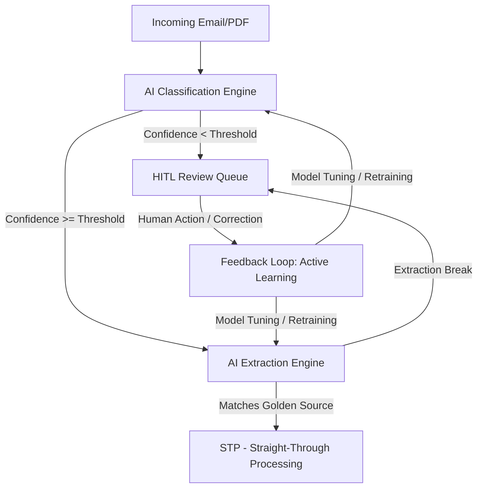

# AI/ML & Human-in-the-Loop (HITL) Roadmap for FX Trade Settlement Pipeline

This document outlines the strategic integration of **Machine Learning (ML)**, **Artificial Intelligence (AI)**, and **Human-in-the-Loop (HITL)** workflows within the FX Trade Settlement pipeline. It is designed to be highly technical for engineers yet accessible and value-driven for Business Analysts (BAs) and clients.

---

## 1. AI/ML Opportunities in the FX Settlement Pipeline

Transitioning from a deterministic, rule-based system (regex and table-matching) to a cognitive AI/ML pipeline allows the system to scale, handle unstructured anomalies, and continuously self-improve.

### A. NLP for Unstructured Cover Emails & PDFs (Local LLMs)
* **What it is**: Integrating locally hosted, small language models (SLMs) like **Llama-3-8B-Instruct** or **Mistral-7B** (using frameworks like `Ollama` or `vLLM` to comply with local privacy rules).
* **Technical Details**: Bypassing strict regex anchors by prompt-engineering the model to return structured JSON payloads representing trade details.
* **Business Value**: Eliminates rigid parser maintenance. When counterparties change confirmation formats or email layouts, the LLM reads and extracts them using semantic reasoning rather than structural rules.

### B. Layout-Aware Document Intelligence (OCR + LayoutLM)
* **What it is**: Multi-modal ML models that read both text and spatial layout (where the text is located on the page).
* **Technical Details**: Utilizing **LayoutLMv3** or **Donut (Document Image Transformer)** to identify trade metadata blocks directly from PDF/image geometry.
* **Business Value**: Allows the system to read scanned PDFs, photos of SSI tickets, or complex visual grids that do not have a digital text layer, maintaining high accuracy across diverse paper confirm structures.

### C. Predictive Match & Break Scoring
* **What it is**: Machine learning classification (e.g., XGBoost or Random Forests) to score match confidence between extracted trades and Golden Source records.
* **Technical Details**: Training a model on historical settlement data to learn acceptable numeric break tolerances and match patterns (e.g., matching counterparties like "Société Générale" vs "SocGen" or "SG").
* **Business Value**: Reduces false-positive reconciliation breaks by dynamically adjusting tolerance margins based on the volatility of the asset pair or historical counterparty behaviors.

---

## 2. Human-in-the-Loop (HITL) Design Pattern

HITL is the core operational bridge between AI predictions and strict financial auditing. It ensures **100% data integrity** while maximizing automation efficiency.

### A. Confidence Scoring & Routing
* **Technical Details**: The extraction and classification engines output a confidence score ($[0.0, 1.0]$). If the score falls below a set threshold (e.g., $0.85$), the case is automatically diverted to a **Manual Review Queue** in the UI.
* **Business Value**: Protects the firm against extraction errors. High-confidence trades are processed automatically (Straight-Through Processing - STP), while BAs only spend time reviewing complex, low-confidence edge cases.

### B. Active Learning Feedback Loop
* **Technical Details**: When a BA manually corrects an incorrect value in the review UI (e.g., changing an extracted strike rate from `0.965` to `0.9658`), the system logs the **original input, extraction mistake, and user correction**. This triplet is stored in a training database.
* **Business Value**: The AI system learns from human corrections. Periodically, the model is fine-tuned on this BA correction dataset, ensuring the extraction engine becomes smarter and requires fewer manual corrections over time.

---

## 3. High-Impression Demo Cases & Client Solutions

When presenting this project to a client, showcasing how the pipeline handles real-world complexity is key. Here are four high-impact cases, their under-the-hood challenges, and their solutions:

### Case 1: The "No-Context" Ambiguous Email
* **The Scenario**: An email arrives with the subject *"Settlement query"* and body *"Did you receive our trade?"* with no trade ID, dates, or currency details in the text, but carries a PDF confirmation.
* **The Demo Challenge**: Traditional systems fail because they only look for trade references in the email envelope.
* **The AI/ML Solution**: 
  - The **Classifier** scans the PDF attachment, extracts the trade ID `FXOPT-2026-00106`, and notes the relevance of the email.
  - The UI alerts the BA: *"Relevance confirmed via PDF scanning; Email body lacked identifiers."*
* **Client Impression**: Demonstrates that the system actively inspects attachment structures to establish context, rather than relying on lazy keyword matching in the subject line.

### Case 2: Hand-Written / Scanned SSI Documents
* **The Scenario**: A counterparty prints out a standard settlement sheet, hand-signs it, scans it as an image, and sends it as a non-searchable PDF.
* **The Demo Challenge**: Regular text extraction tools (`pdfplumber` or `pypdf`) return zero bytes of text.
* **The AI/ML Solution**:
  - The pipeline detects a "zero-text PDF" and automatically routes it to a **local OCR pipeline** (PaddleOCR/Tesseract).
  - The OCR reads the coordinates, constructs the text layer, and hands it to the extraction parser.
  - If characters are blurry, the UI flags them in yellow for BA verification.
* **Client Impression**: Proves the system is robust enough to handle paper-based, real-world back-office scans without crashing.

### Case 3: Semantic Counterparty Matching ("SocGen" vs "Societe Generale SA")
* **The Scenario**: The email attachment list labels the counterparty as *"SocGen"*, but the Golden Source database lists them as *"Société Générale S.A."*.
* **The Demo Challenge**: String comparison throws a critical reconciliation break due to name mismatch.
* **The AI/ML Solution**:
  - A **Semantic Embedding Model** (e.g., SentenceTransformers) compares the vector distance of the two strings.
  - It resolves them as a $98\%$ semantic match and auto-maps the trade to the database ID, flagging it as an **Enriched Match** instead of a **Break**.
* **Client Impression**: BAs spend hours manually resolving naming discrepancies. Showing an AI auto-resolving these naming variants is a major selling point.

### Case 4: Multi-Deal "Blotter" Attachments
* **The Scenario**: A counterparty sends a single Excel/PDF file containing a list of 50 trades, some of which match the Golden Source, and some of which have rate breaks.
* **The Demo Challenge**: The system must process them individually rather than rejecting the entire file.
* **The AI/ML Solution**:
  - The pipeline splits the multi-trade sheet into 50 distinct sub-cases.
  - The UI showcases a dashboard grouping these trades under a single parent message.
  - Clean trades are auto-settled, while the 2 trades with rate breaks are highlighted in red, allowing the BA to edit them in-place.
* **Client Impression**: Shows how the system handles large-volume batch processing gracefully, giving BAs atomic control over individual deals.
